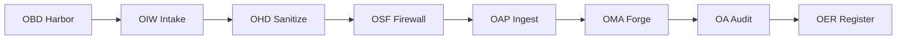

<!-- ═══════════════════════════════════════════════════════════════════════ -->
<!--                   LONGLEO - OMNICLAW PROFILE README                    -->
<!-- ═══════════════════════════════════════════════════════════════════════ -->

<div align="center">

<!-- ANIMATED BANNER -->


<!-- TYPING ANIMATION -->
<p align="center">

</p>

<!-- BADGES -->
<p align="center">
  <a href="https://www.facebook.com/ResourceRookie2023" target="_blank">
    
  </a>
  <a href="mailto:longdragon28797@gmail.com">
    
  </a>
  <a href="https://github.com/LongLeo287/OmniClaw">
    
  </a>
  <a href="https://github.com/LongLeo287">
    
  </a>
</p>

<!-- PROFILE VIEWS -->
<p align="center">
  
  
</p>

</div>


##  About the System

<table align="center">
<tr>
<td width="55%" valign="top">

### 🚀 Core Mission
**[OmniClaw](https://github.com/LongLeo287/OmniClaw)** is a monolithic, self-evolving AI Operating System. Structured on a strict 3-Layer Architecture (Core, Brain, Vault), it empowers 1,900+ micro-skills and a ChromaDB Vector RAG brain — all running autonomously and securely on local hardware.

- 🏛️ **8 Core Daemons:** OBD, OIW, OHD, OSF, OAP, OMA, OA, OER
- 🛡️ **Zero-Trust Separation:** `vault/` Cold Storage isolation vs `brain/` AI-Context zone
- 🧠 **ChromaDB RAG + Graph Topologies** — `_DIR_IDENTITY` Matrix tracking
- ⚖️ **OA Academy** — 8 Pillars of automated system integrity

</td>
<td width="45%" valign="top">

### ⚡ Live Terminal
```yaml
OS     : OmniClaw V5.0 (Production)
Core   : 8 Daemons | 3-Layer Boundary 
Skills : 1936 Plugins Mapped & Tracked
Brain  : brain/chroma_db/ [Vector Engine 🟢]
Vault  : vault/knowledge/ [Quarantined 🔒]
Threat : 🟢 CLEAN — 0 IOC detected
Pillar : 8/8 Active (Metadata Hygiene ✅)
Signal : longdragon28797@gmail.com
```

</td>
</tr>
</table>


## 🏛️ OmniClaw — 8 Core Daemons

<div align="center">

|  | Daemon | Role | Authority |
|:---:|:---:|---|---|
| ⚓ | **OBD** | *Harbor Network* | Local Hub / Background Server connections |
| 🔬 | **OIW** | *Intake Workflow* | Harvests external repos securely into `vault/` |
| ⚕️ | **OHD** | *Health Daemon* | System sanitation · Dependency purging |
| 🛡️ | **OSF** | *Firewall/Security* | Real-time Zero-Trust Threat Interception |
| ⚡ | **OAP** | *Async Processor* | Offline data routing & heavy ingestion |
| 🧬 | **OMA** | *Architect Forger* | Constructs Identity metadata for AI Context |
| ⚖️ | **OA**  | *Academy (Judge)* | Enforces 8 Pillars of architectural integrity |
| 🏛️ | **OER** | *Ecosystem Registry* | Sole issuer of tracking IDs for 1900+ skills |

</div>




## 🛡️ Security & Storage Architecture

<div align="center">

| Layer | Mechanism | Status |
|---|---|:---:|
| 3-Tier Storage | STRICT `core/` (Logic) · `brain/` (AI Memory) · `vault/` (Raw Dump) | 🟢 Active |
| Supply Chain Defense | OSF Threat Scanners · `_DIR_IDENTITY` enforcement | 🟢 Active |
| Zero-Trust Sandbox | Unverified code isolated in Vault; AI context runs safely in Brain | 🟢 Active |
| Global Blacklist | Auto-rename of disabled `.json` to mitigate Dependabot warnings | 🟢 Active |
| Component Bridges | Disconnected auto-boot hooks for secure explicit-launch of External LLMs | 🟢 Active |

</div>


## 🛠️ The Tech Forge

<div align="center">

### 🧠 AI & LLM Ecosystem


### 💻 Engineering Stack


### 🏗️ OmniClaw Architecture


</div>


<div align="center">


<p align="center"><em>"Ethics in AI is not a declaration — it's in the strict <code>vault/</code> quarantine, the 3-Layer boundary, and the OSF Firewall."</em></p>

<p align="center"><strong>The Future of OS — Directed by CEO LongLeo</strong> 🌌</p>

</div>
